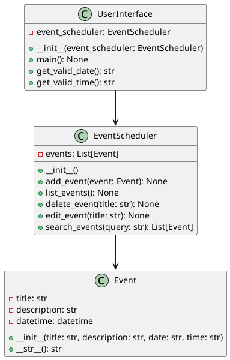
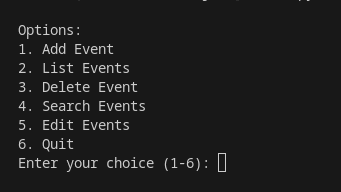
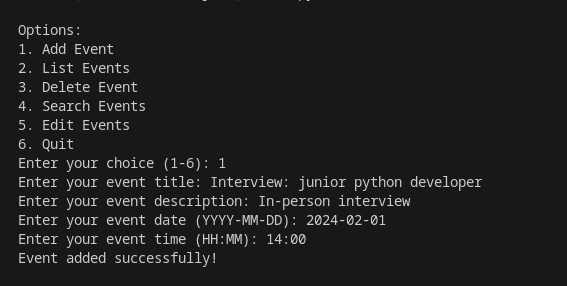
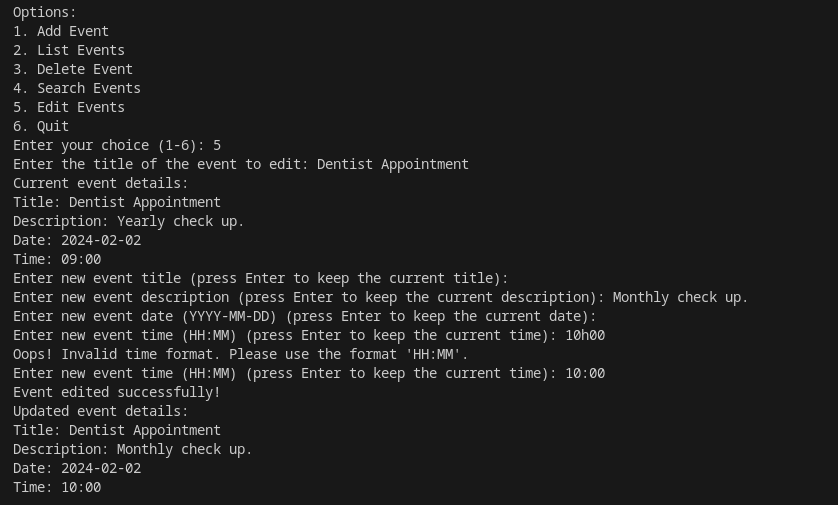
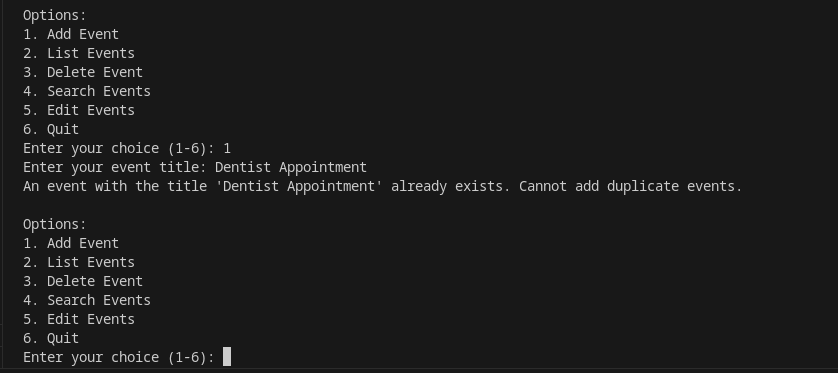
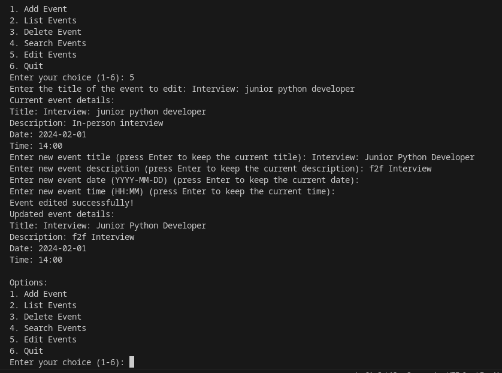

# README

## I. Design Decisions:

### a. Simple Application Design:
This application follows a simple and straightforward design, eliminating the need for complex design patterns.

### b. Modular Design:
Code is modularized into different files (e.g., event_class.py, event_scheduler.py, user_interface.py, and test_event_scheduler.py), focusing on specific functionalities for improved organization and maintainability.

### c. Object-Oriented Design (OOP):
Encapsulation of related functionalities and data within classes promotes code reuse and clarity.

### d. Error Handling and Validation:
Includes error handling and validation mechanisms, such as validating date and time formats, handling invalid inputs gracefully, and raising informative exceptions.

### e. User Interface (UI):
The command-line interface provides a simple and user-friendly interaction with clear options for users.

### f. Real-Time Feedback:
Provides real-time feedback to users, communicating outcomes (success or errors) during operations like adding, editing, or deleting events.

### g. Data Storage:
Utilizes a simple in-memory structure to store events within the EventScheduler class.

### h. Unit Testing:
Includes unit tests in test_event_scheduler.py for early issue detection and code maintenance.

See below screenshot for unit testing output:

### i. Search Functionality:
Enhances utility with search functionality, allowing users to find events based on titles, dates, or keywords.

### j. User Prompting for Duplicate Titles:
Checks for duplicate titles when adding or editing events, preventing unintentional duplication.

## II. Design Principles Applied:

### a. "DRY" Principle:
Reduces redundancy, creates modular and maintainable code, ensuring scalability in the future.

### b. Separation of Concerns (SoC):
Code is divided into multiple files with specific responsibilities, promoting modularity and ease of maintenance.

### c. Single Responsibility Principle (SRP):
Each class has a single responsibility, promoting maintainability and clarity.

### d. Modularity:
The code is modular, facilitating easy extension or modification of specific functionalities.

### e. Readability:
Meaningful names, consistent indentation, and concise comments contribute to code readability.

### f. Use of Functions and Classes:
Utilizes functions and classes to encapsulate functionality, promoting clear organization.

### g. Error Handling:
Incorporates mechanisms to gracefully handle invalid inputs or unexpected situations.

### h. Efficiency:
Aims for efficiency using appropriate data structures and algorithms.

### i. Documentation:
Provides docstrings for functions and classes, enhancing code documentation.

## III. Diagrams:

### Sequence Diagram:

### Class Diagram:

## IV. Application Usage Screenshots:

### a. User Menu:

### b. Add Event:

### c. List Events:

### d. Delete Event:

### e. Search Events:

### f. Edit Event:

### g. Exit Application:

### h. Prevent Duplicate Events:

### i. Real-Time Validation:

### j. Event Update Notification:

