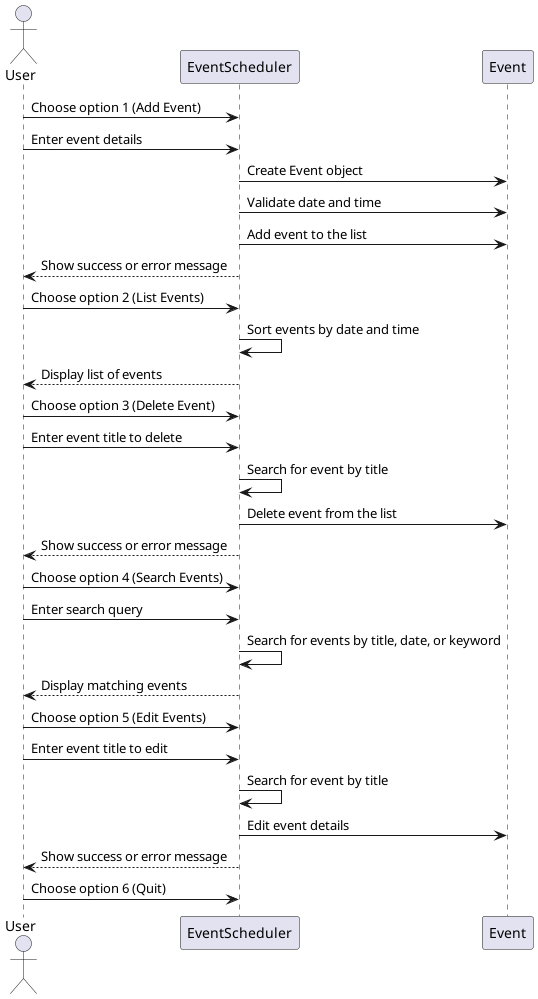

I.Design Decisions:

a. This is a simple and straightforward application and does not need complex design patterns.

b. Modular Design: Modularized your code by separating it into different files (e.g., event_class.py, event_scheduler.py, user_interface.py, and test_event_scheduler.py). Each file focuses on specific functionalities, making the code more organized and maintainable.

c. Object-Oriented Design (OOP): The use of classes (Event and EventScheduler) reflects an object-oriented design. This approach helps encapsulate related functionalities and data within classes, promoting code reuse and clarity.

d. Error Handling and Validation: The code includes error handling and validation mechanisms. For instance, validate date and time formats, handle invalid inputs gracefully, and raise informative exceptions.

e. User Interface (UI): The command-line interface provides a simple and user-friendly way to interact with the application. Users can easily understand and navigate through the options.

f. Real-Time Feedback: The application provides real-time feedback to the user, informing them about successful operations or errors. For instance, when adding, editing, or deleting events, the program communicates the outcome to the user.

g. Data Storage: Use a simple in-memory structure to store events within the EventScheduler class. 

h. Code Readability: The code is well-structured and adheres to Pythonic principles. The use of docstrings, meaningful variable and function names, and comments enhances code readability.

i. Unit Testing: The inclusion of unit tests in test_event_scheduler.py demonstrates a commitment to ensuring the correctness of the code. This helps catch issues early and supports code maintenance.

l. Search Functionality: The addition of search functionality enhances the application's utility, allowing users to find events based on titles, dates, or keywords in descriptions.

m. User Prompting for Duplicate Titles: When adding or editing events, the application checks for duplicate titles and informs the user if the title is already in use. This prevents unintentional duplication of events.

II. Design Principles Applied.

a. "DRY" Principle: Reduce redundancy, create more modular and maintainable code. Ensure the code is easy to manage and improve the overall readability and efficiency of development.Ensure a more scalable workbase in future should the need arise.

b. Separation of Concerns (SoC): The code is divided into multiple files, each with a specific responsibility. For example, there are separate files for the Event class, the EventScheduler class, and the user interface (user_interface.py). The TestEventScheduler class is a set of unit tests designed to verify the correct behavior of the EventScheduler. This separation makes the code modular and easier to maintain.

c. Single Responsibility Principle (SRP): Each class has a single responsibility. The Event class handles the representation and validation of individual events, the EventScheduler class manages the collection of events, and the user_interface.py file focuses on user interaction.

d. Modularity: The code is modular, making it easy to extend or modify specific functionalities. For instance, adding new features or changing the implementation of existing ones can be done without affecting other parts of the code.

e. Readability: Meaningful variable and method names, consistent indentation, and concise yet informative comments contribute to its readability.

f. Use of Functions and Classes: The code utilizes functions and classes to encapsulate functionality. Functions are used to perform specific tasks, and classes are used to represent objects with related properties and behaviors.

g. Error Handling: The code incorporates error handling mechanisms to gracefully manage invalid inputs or unexpected situations. For example, the code checks for valid date and time formats, handles events not found during deletion, and informs the user about duplicate titles.

h. Efficiency: While not explicitly mentioned, the code aims for efficiency by using appropriate data structures (e.g., lists) and algorithms. The sorting of events based on date and time is one example of optimizing functionality.

i. Documentation: Docstrings are provided for functions and classes, offering a clear description of purpose, parameters, and return values. This contributes to code documentation and makes it easier for others to understand and use the code.

III. Sequence Diagram:

Class Diagram:

IV. Application Usage Screenshots:

a. User Menu:
The user receives a list of six options to choose from.

b. The user can select '1' to add an event.

c. The user can select '2' to list all events.

d. The user can select '3' to delete and event.

e. The user can select '4' to search events.

f. The user can select '5' to edit an event.

g. The user can select '6' to exit the application.

h. The user can't add duplicate events:

i. The users input is validated in real time to avoid the application crashing.

j. The user is notified immediately when an event is updated successfully.

